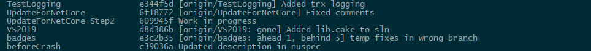

# Branches Deep Dive

We learned that a branch can be a local branch or a remote branch.

The local branch lives in your local repository, and the remote branch lives in the remote repository.

Then we have **tracking branches**.

A **tracking branch** is a local specific that contains the binding between your local branch and a given remote branch.   Another name for  *tracking branch* is *upstream branch*.  

**Trap:**  You can't work locally with a tracking branch.

When cloning a repo, you will (normally) get a master branch that is set up to automatically track your remote origin/master branch. 

For the other branches you need to set up your tracking branch, which is done by creating a local branch (which you can work on) and thus the tracking is set up.

## Creating local branches from a remote

If you accept that the local name is to be identical to the remote name you can just do:

Assume a remote branch named  *whatever*

```cmd
git switch whatever
```

This is a shorthand for:

```cmd
git switch --track origin/whatever
```

Let say you for some reason (and it better be good), you want a different name on your local branch than on the remote:

```cmd
git switch -c surprise origin/whatever
```

Another weird case is that you have a local branch, and now want it to track some remote branch.  (What could possibly go wrong.....).  Or, you want to just set it to some remote branch.  This could come in handy if you're trying to correct up something that has gone awfully wrong.

This is done using the *--set-upstream* option, or short *-u*.

```cmd
git branch -u origin/whatever
```

**Trap:** Be aware that git is case sensitive!

## Understanding what tracking branches you have

```cmd
git branch -vv --no-color
```




**Tip:** The *--no-color* is just to get rid of the coloring which may mess up your output.  Try without, and if information is not visible, use option

Now, if you want to see ALL your remote branches (including those not tracked), you can use the command:

```cmd
git branch -r
```

or even a bit more 'nerdy'

```cmd
git ls-remotes --heads
```

**Note:** None of these command goes to the actual remote.

## Set up tracking branched directly

```
git switch --track origin/branchname

or

git branch -u origin/branchname

```
where branchname is the remote branch name.


## Untrack remote branches

You can also remove the tracking branch.

```
git branch --unset-upstream

or

git branch -d -r origin/<remote-branch-name>

followed by

git config --unset branch.<branch>.remote
git config --unset branch.<branch>.merge

```

For more information, [see this](https://stackoverflow.com/questions/3046436/how-do-you-stop-tracking-a-remote-branch-in-git)

## Creating remote branches from local

Assume you have created a local branch, which does not exist remote:

```cmd
git branch anotherone
```

You have created it, but you're not switched to it.

or

```cmd
git switch -c anotherone
```

You have created it, and switched to it.

To get this to the remote and at the same time setting up a tracking branch, you do:

```cmd
git push -u origin anotherone
```

You need to create the remote branch, before the tracking rbanch is created.  The push command will do that for you.  Otherwise you must set the upstream to a an existing remote branch, as shown earlier.

## Summary

* A remote branch is shown in a local repository as a reference
* A tracking branch is a connection between a local branch and the remote branch reference
* A local repository is de-coupled from the remote
* A local repository is updated from the remote by the fetch statement.  The fetch statement is a part of the pull command
* A local git repository is disconnected **all the time** from the remote(s), except when you do a fetch or a push.
