# Example of a branching/merging/rebasing story

## Developer 1

First change something on the remote branch 'update' twice
```
git pull
```
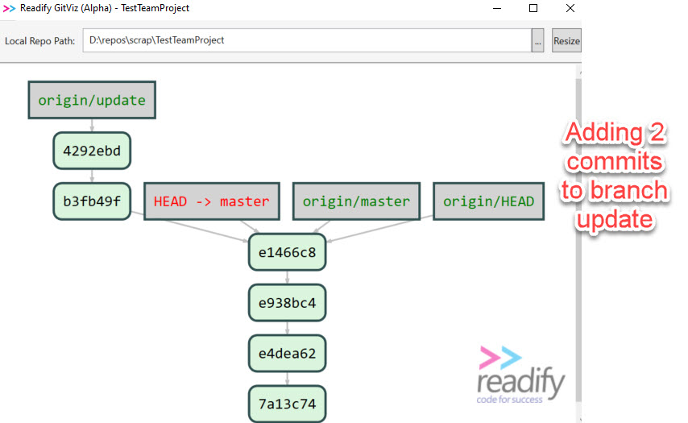

Change something on remote branch master and pull again

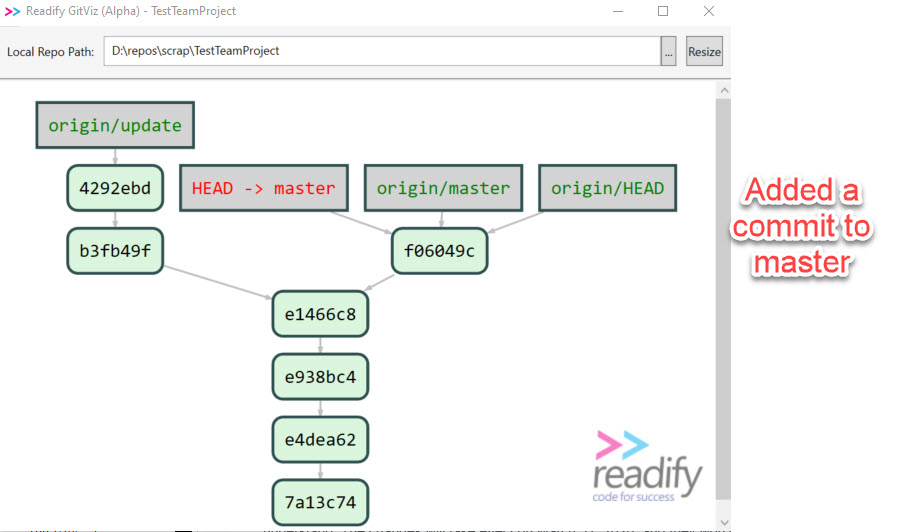

Now merge doing a rebase and fast-forward merge on server, and the a pull again

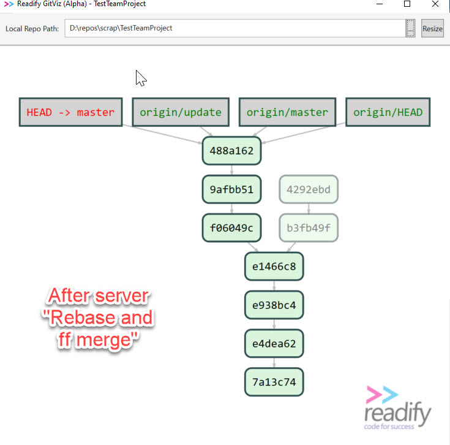

Another developer (Dev 2) already had a clone of the repo - before the rebase/merge done, and he creates a local branch from origin/update, then add a change there.

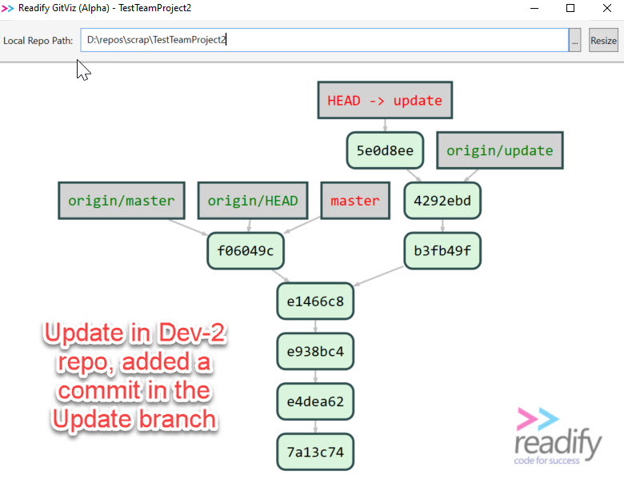

He then tries to push her change up to the server, and is 'rewarded' by this:

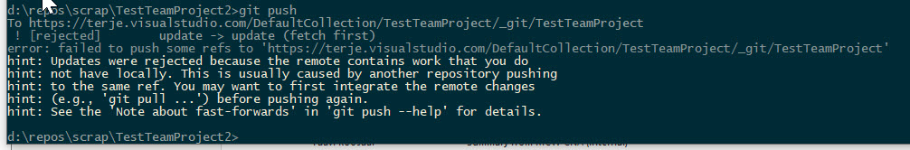

So the server is proteced from the changes, and the developer does not have any force rights, so all he can do is to follow the suggestion and do a pull.

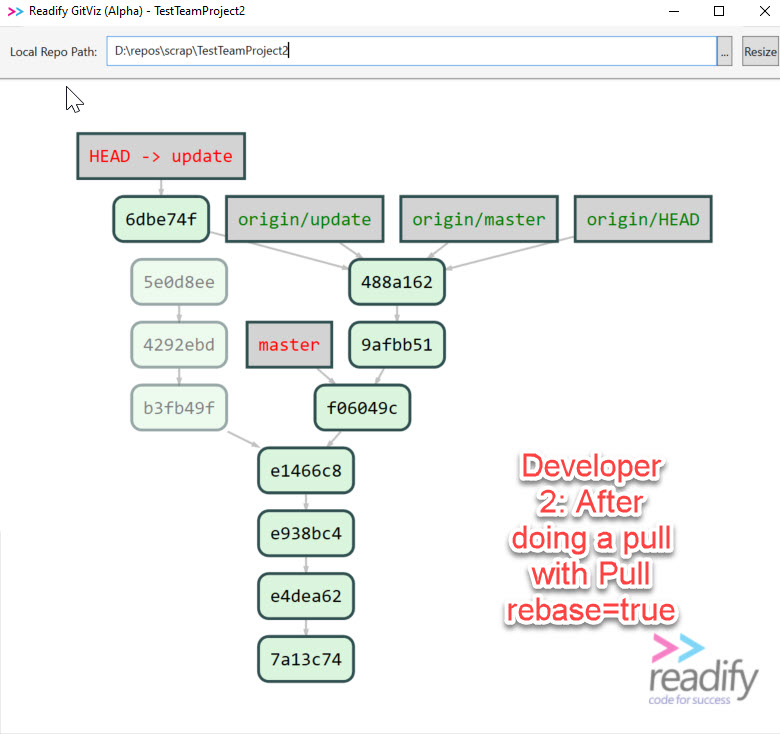

Observe what happened!  

The 5e0d8ee is rebased into 6dbe74f.  

Let's check the reflog

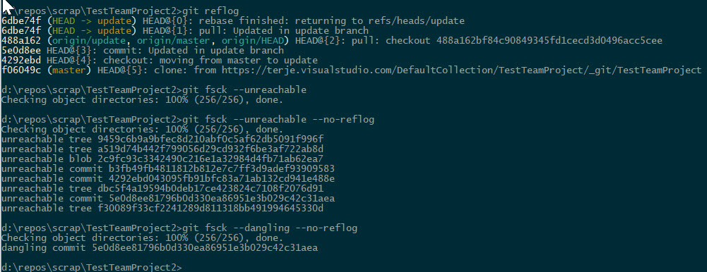

Lot's of garbage there now.  Dangling objects.  So, let us get rid of that:

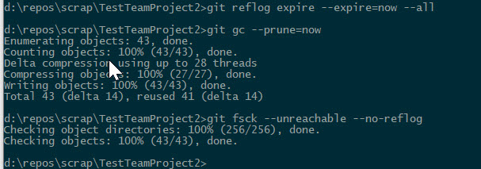

Looks better now!

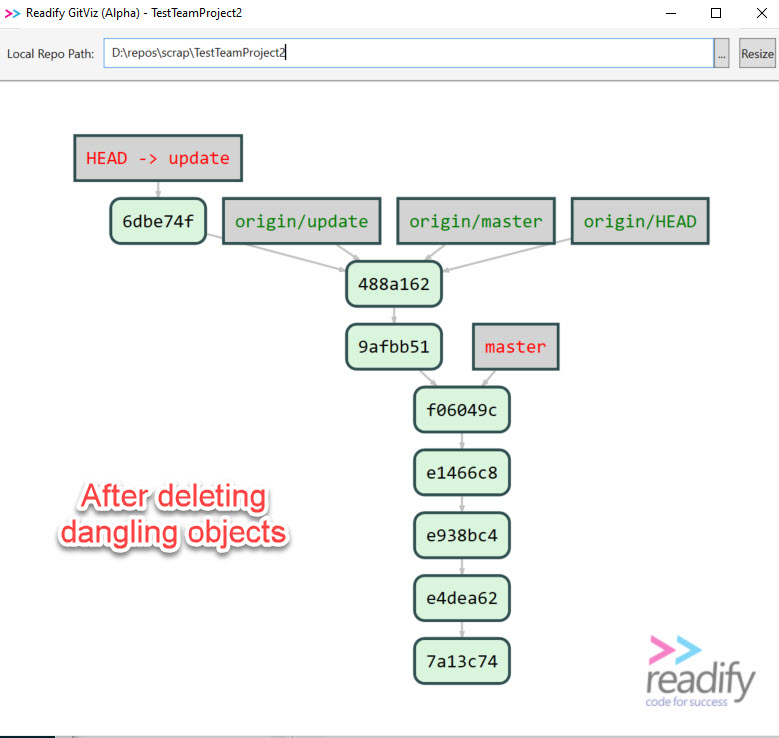

Now he can push the update branch.

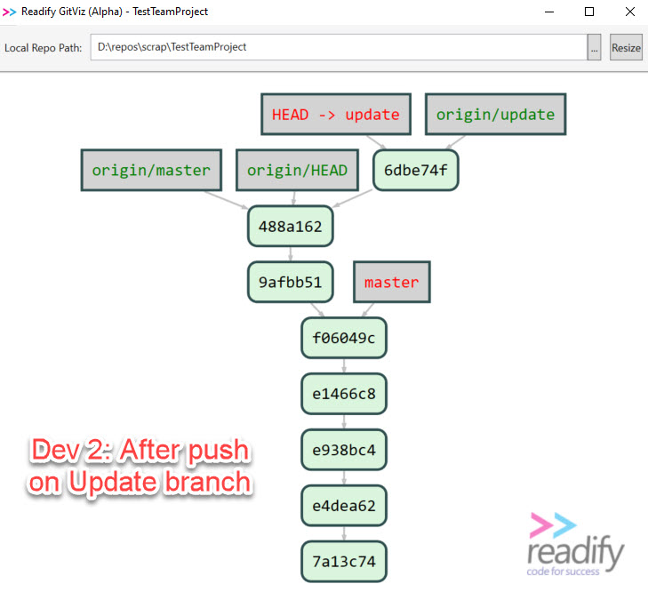

Let us update the local master by merging with origin/master

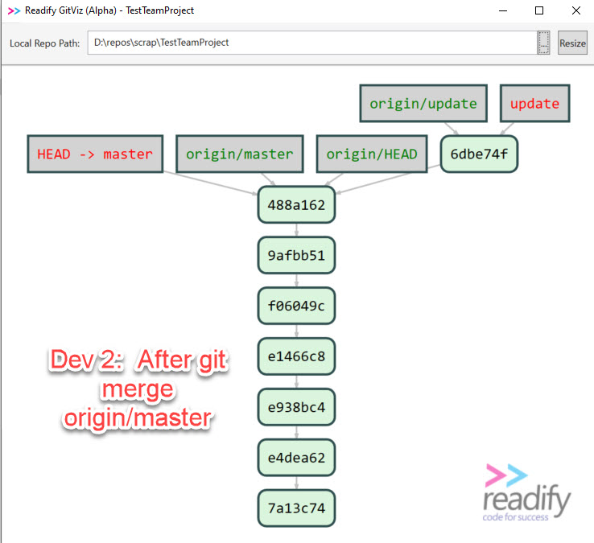

And then we do a pull request with a merge commit on the server, and pull that down

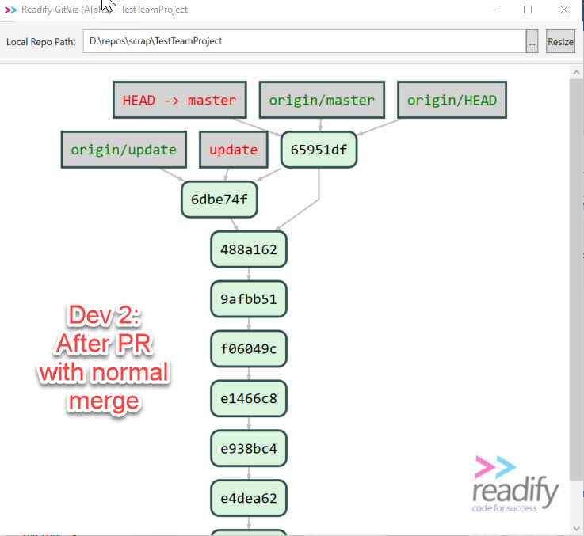
