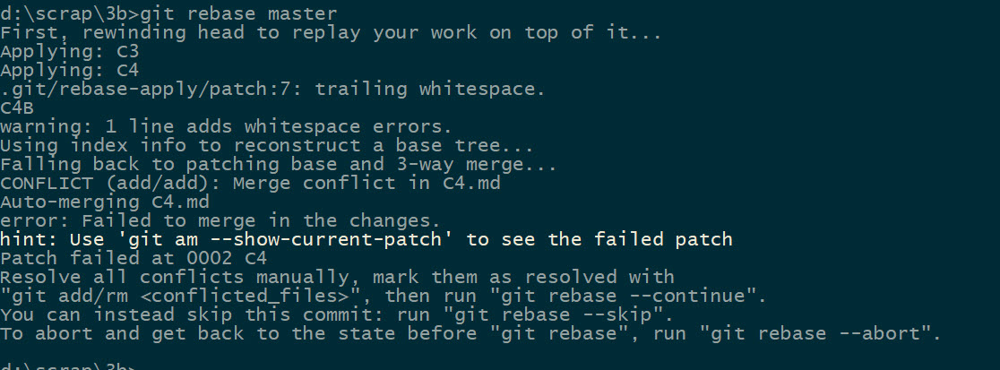
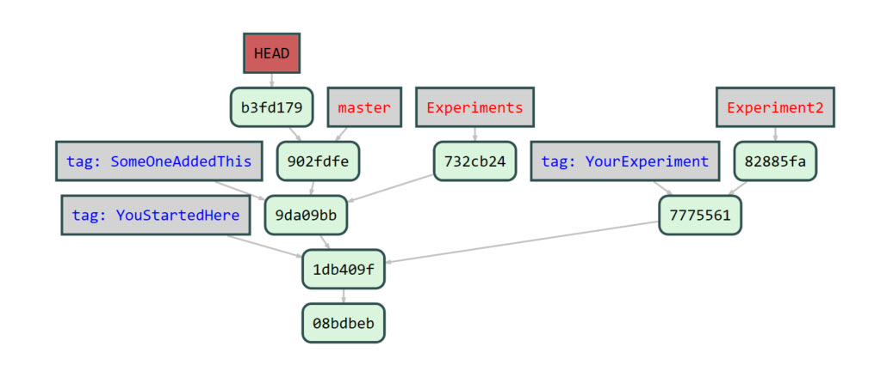
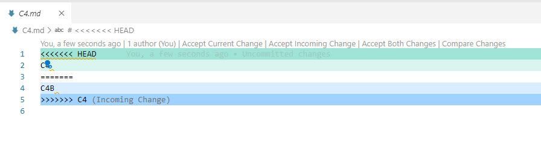
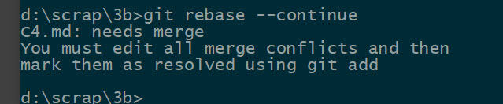

# Exercise 3b.1:  Rebasing

## Simple rebasing

Create a new empty local repository

Then run the command file:  Exercise-3b.1.cmd, to create the basic setup

Open up GitViz on the repo

You're now standing at the branch Experiments

Notice the tags added to mark the excisting commits.

Also, it **can** be wise to make screenshots of each step you do here, so that you can go back and see what really happened.  

### Scenario

Lets just assume that someone else did the change in the master branch.  You really want your commit in the experiment branch to be **based** on that commit, rather than the one at "YouStartedHere".

### Action

The rebase let you do that:

```
git rebase master
```

What did happen ?

Is the new commit the same as the old one?

What can you say about immutability?

You can now observe

## Not so simple rebasing

Go to master

Run the follwing commands:

```
echo C4 > C4.md
git add *
git commit -m"C4"
```

Go back to the tag YourExperiment

(Note:  You're now detached)

Create a new branch here, Experiment2

Run the same commands again:

```
echo C4 > C4.md
git add *
git commit -m"C4"
```

Then rebase this branch onto master 

```
git rebase master
```

You should now see something like:



as the command failure.



as what GitViz shows

And if you open the file C4.md in VS Code, you should see something like:




Now, you can choose to Accept Both Changes, and then you can edit the file to your liking.

You can run git status to see the options you have:

Then run:

```
git rebase --continue
```

and you should be rewarded with this message



The point here is that even if you accepted the changes in the editor, git is not really aware of them.  You need to stage the edits first.

(Other tools may behave differently)

Also note that you now got two commits instead of one.

What are the content of each of those two commits?

What is the dimmed commit ?

## Tricky rebasing

Create an empty remote repo on GitHub

Push the master branch of this local repo to that remote.

Then go to the Experiments branch, push that too on the remote.

Now on GitHub, change to the Experiments branch, and add new file there named C5,  and commit it with C5 as the commit message.

Now locally, go to the Experiments branch and rebase that onto master

When done, then pull down from the remote

What happened ?

(Take screenshot)

