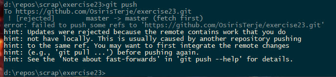

# Ex 4.4 Cleaning up - Take 4,  Pull rebasing

Before doing these exercises, ensure you have the config properly set up with merge tools.


Join up with your team, and agree upon a common repository where everyone has access.  It can be one of the team members own repo, just invite in the others on the team, or some other "scrap" team project.

Assign one as the team leader, Dev0

If the repo doesn't exist, Dev0 creates it on server, and initializes it with a readme.md file.

Everyone clone down the repo.

The other Devs are Dev1, Dev2 and so forth.


## **DO 1**

Each Dev now creates and commits a new file in the master branch.

Now Dev0 does a change in the readme.md file **on the server** and commits that directly to master.  (This could have been the first developer happily pushing up to master.)

Now each developer try to do a Git pull.

It should fail with something like this:



Now, if you do a pull now, you would need to merge in the changes you did.  That would give you a new unneeded merge commit.

So, let us do a rebase here:

```
git pull --rebase
```

Look up in GitViz what happened.

## **DO 2**


Each Dev creates their own branch locally, and adds a commit there, with a new file.

Now Dev0 does a change in the readme.md file **on the server** and commits that directly to master.

Each Dev does a fetch locally.  You see the new commit on origin/master.

Both your dev branch and master points to the same commit, and obviously master is not aligned with origin/master but have diverged.

Go to master branch, and then you actually **will** get that message.

So now you can do the git pull --rebase again, and after that all is well.....

Except,  your dev branch is still pointing to the former commit.

* What is the difference between the commit your dev branch is pointing to, and the one that master is pointing to?

Now, if you rebase your dev branch on to master, what will happen?

a) You get the commit that your dev branch is now pointing to added as a new commit on top of master

b) The dev branch and master will point to the same commit, which is the one that the master is pointing to now

Explain your answer!

## **DO 3**

Each dev now adds a new commit to their local dev branch, and merge that to the master.

Verify with GitViz that master now points to the merge-commit.

Dev0 does another fix **on the server** and commits that to master there.

Do a git fetch to get it down, so that you can easily see how it looks in Gitviz (take a screenshot too).

Now, do a git pull --rebase

**Did it go well ?**

**What disappeared ?**

A git pull rebase, rebases on top of **origin/master**, so we lost the merge commit(s).

## **DO 4**

Add a new file in master - name it 'a.md' and add some text in it, commit it.

Create a new branch and add a new file with the same name 'a.md' and add some different text in it.

Go back to master, and merge in the new branch.

You will now get a merge conflict.

Run git mergetool and accept both changes.  Also add another line into the file.

Add and commit this merge commit.

See it in Gitviz, and take a screenshot, or just remember the commit SHA for the merge.

Now, on server, make a change to one of the files there, and commit that one.

Locally again, do a 

```
git pull --rebase
```

Run git status afterwards, and see if everything looks correct or not.

**Did it go well ?**

If you have a mess, suggest how to fix it.


## Configuring git pull rebase

It can be a good idea to nearly always use rebasing when pulling.  Most tools allow that setting, but you can actually also set git to that by default.

From the command line:

```
git config --global pull.rebase=true
```

For a nice writeup on rebasing on pull, [see this blogpost](http://bit-booster.blogspot.com/2016/02/no-foxtrots-allowed.html)


Note that sometimes this may hit back on you, then just turn it off.

Do you see when it may be counterproductive to use pull rebase ?


