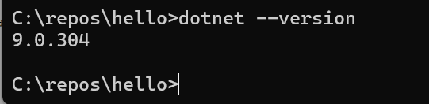
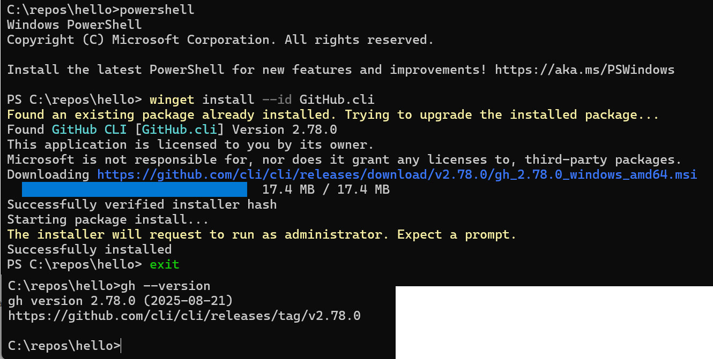
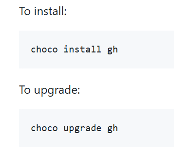
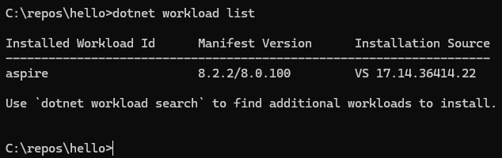
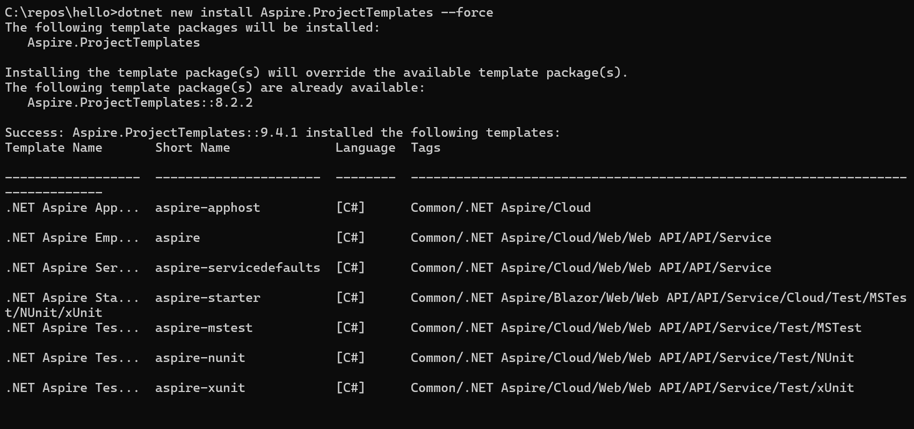
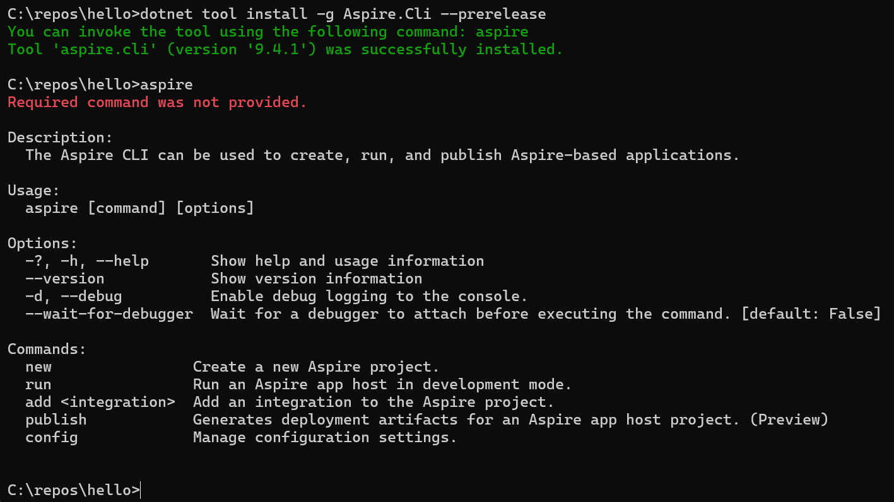
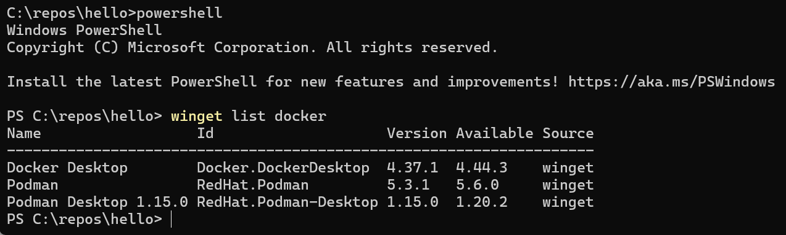

# Installing tools

1. Visual Studio 17.14.* or greater
2. dotnet sdk

Check that you have the latest SDK, currently 9.0.304

If not, [Install sdk](https://dotnet.microsoft.com/en-us/download/dotnet)

3. Install [Github CLI](https://github.com/cli/cli?tab=readme-ov-file#installation)

For windows:

Note:  This will also upgrade existing installations of the `gh cli*`.

You can also install using choco:

4. Remove older Aspire

See [Upgrade your development environment](https://learn.microsoft.com/en-us/dotnet/aspire/get-started/upgrade-to-aspire-9?pivots=vscode#upgrade-your-development-environment) for details.

Check for workloads:

Following these [instructions](https://learn.microsoft.com/en-us/dotnet/aspire/get-started/upgrade-to-aspire-9?pivots=vscode#net-aspire-workload)

Use Windows Search to find the Visual Studio Installer. Choose Modify on the current version (which should now me the latest), then select Individual COmponents, and enter "aspire" in the search box. Just remove the checkmark for that, and start the install. It will then run for a minute or two, and the it will be removed.  Check again that the `dotnet workload list` now are empty.

5. Aspire Project templates

Install the Aspire project templates:

6. Install the Aspire CLI

7. Install container

Use either [Docker Desktop or Podman](https://learn.microsoft.com/en-us/dotnet/aspire/fundamentals/setup-tooling?tabs=windows&pivots=vscode#container-runtime)

If you already have Docker Desktop installed, you should upgrade to the latest.  If you don't rmember how you installed it, which I didn't, use the following to check for winget:

And, as you can see, I have it there, and it is an older version, so I use

`winget upgrade --id Docker.DockerDesktop -e`

to upgrade it.

If you used Choco you can use:

`choco list --local-only | findstr docker`

and to update

`choco upgrade docker-desktop -y`

If you installed it manually, then updating is just like reinstalling: [download the latest installer](https://www.docker.com/products/docker-desktop) from Docker’s site and run it. The installer detects an existing Docker Desktop and upgrades it in place, preserving your settings, images, and containers.

Detailed [instructions here]()

8. AZD Client tool

Install using `winget install --id Microsoft.Azd --source winget`

Check using `azd version`

## Aspire dashboard

This will start when running a local aspire app.

You can also start it manually as a standalone app

See [standalone dashboard documentation](https://learn.microsoft.com/en-us/dotnet/aspire/fundamentals/dashboard/standalone?tabs=bash)

## Aspire Documentation

See [Aspire Documentation](https://learn.microsoft.com/en-us/dotnet/aspire/)

and [Integrations](https://learn.microsoft.com/en-us/dotnet/aspire/fundamentals/integrations-overview?source=recommendations)

and [Additional resources](https://learn.microsoft.com/en-us/dotnet/aspire/fundamentals/setup-tooling?source=recommendations&tabs=windows&pivots=vscode#see-also)

